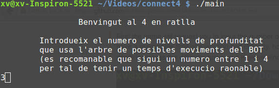
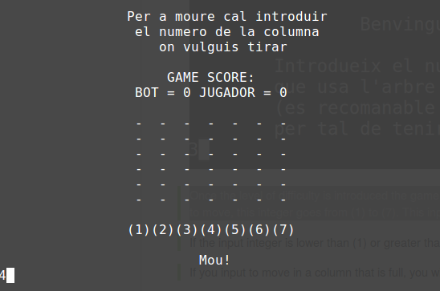
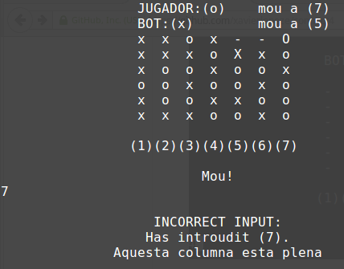
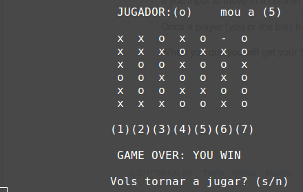
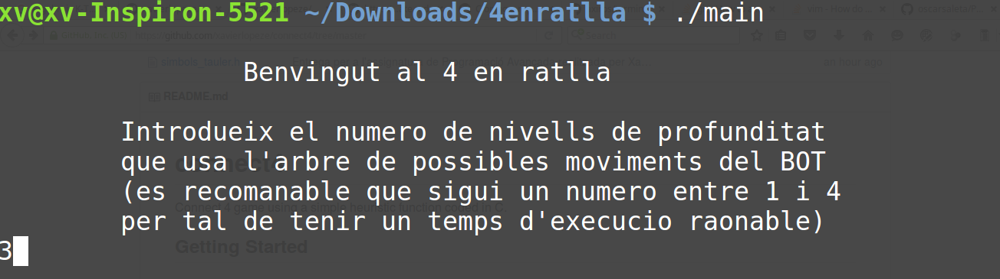

# connect4
Connect 4 game using a simple heuristic function coded in C. 

This game has been fully developed by Xavier López as an assignment of the class "Advanced Programming", Bachelors degree in Mathematics at UAB.

## Getting Started


```
$ git clone https://github.com/xavierlopeze/connect4.git
```

To run the project you will need a C compiler

```
$ sudo apt-get install gcc
```

Compile and run 
```
$ gcc  main.c -o  main
$ ./main
```
## Guided Run
First the game will request you to input the number of levels of depth that you want the heuristic function to use, it is suggested to use 3 in order to have a reasonable time of execution and difficulty, however any integer greater or equal than one can be used. Increasing the levels of depth increases the difficulty, however it increases exponentially the time of execution as well. 
This imput must be an integer.



Once the level of difficulty is introduced the game starts, in order to move you will have to input the number of the colum where you want to move, this integer goes from (1) to (7). This input must be an integer.



If the input integer is lower than (1) or greater than (7) you will get an input error. If you input to move in a column that is full, you will get an input error as well.



When the game is finisehd you can play again, or quit (input 's' to play again or 'n' to quit).



When you quit you will get your final score.



Have fun playing!

## Acknowledgments

Special thanks to Vicenç Soler for his teachings.

## Author
Xavier López

Contact: xavier.lopeze@gmail.com

## License

This project is licensed under the MIT License - see the [LICENSE](LICENSE) file for details
