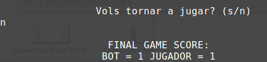

# connect4
Connect 4 game using a simple heuristic function coded in C.

## Getting Started


```
$ git clone https://github.com/xavierlopeze/connect4.git
```

To run the project you will need a C compiler

```
$ sudo apt-get install gcc
```

Compile and run 
```
$ gcc  main.c -o  main
$ ./main
```


